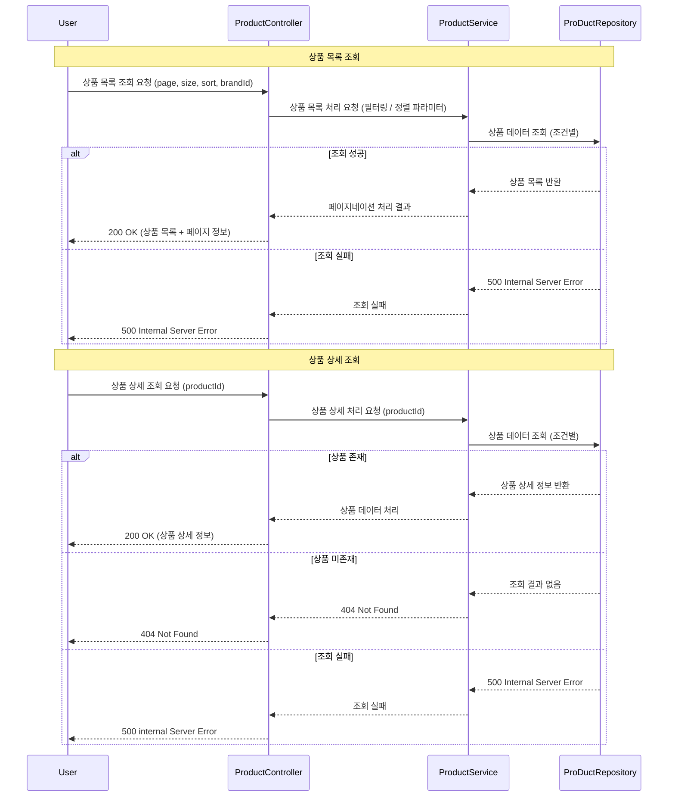
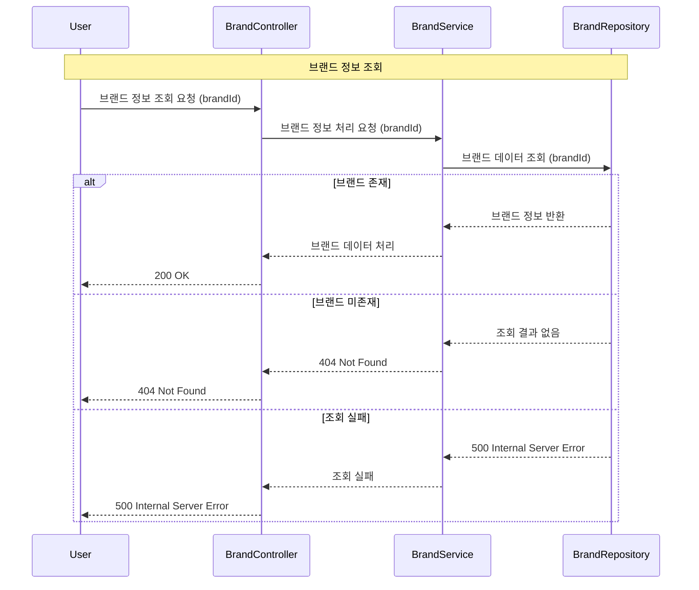
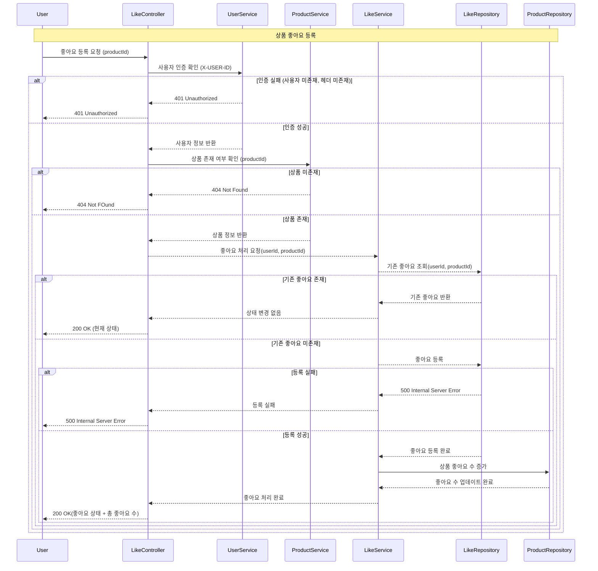
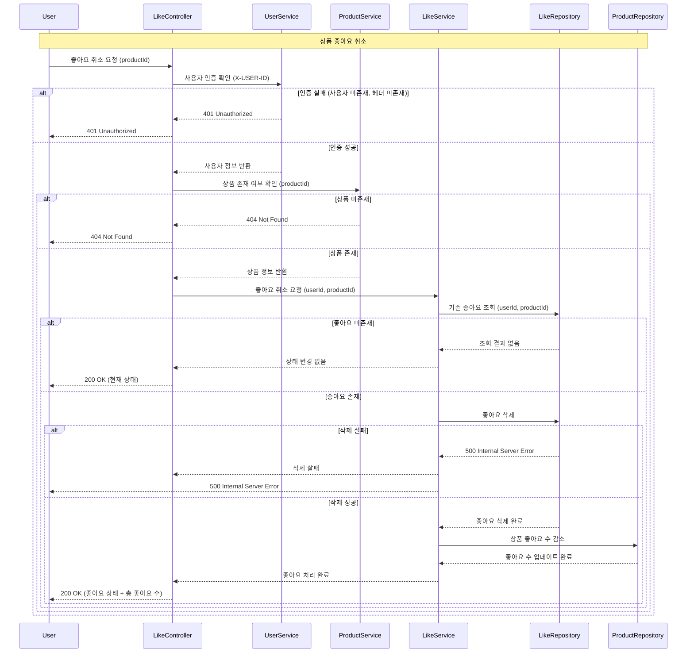
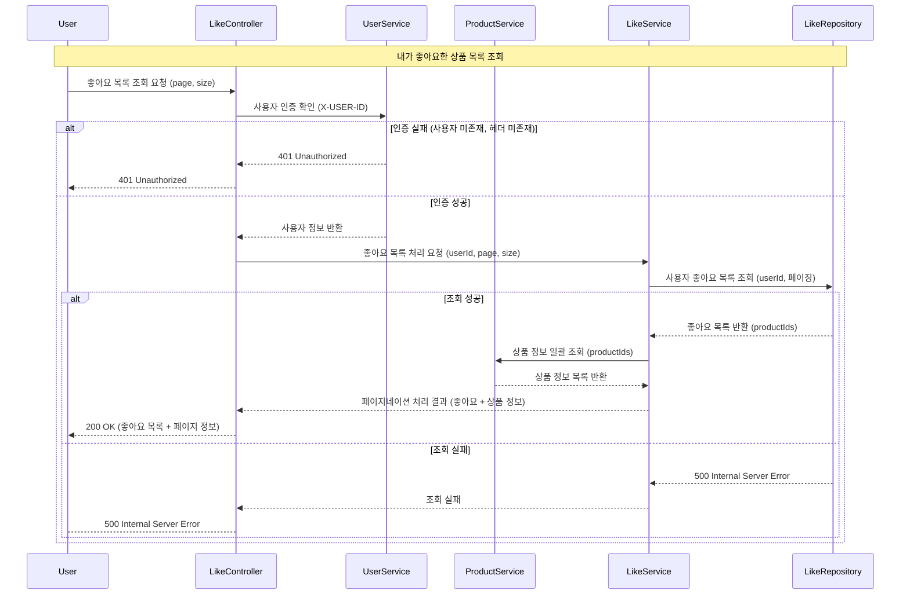
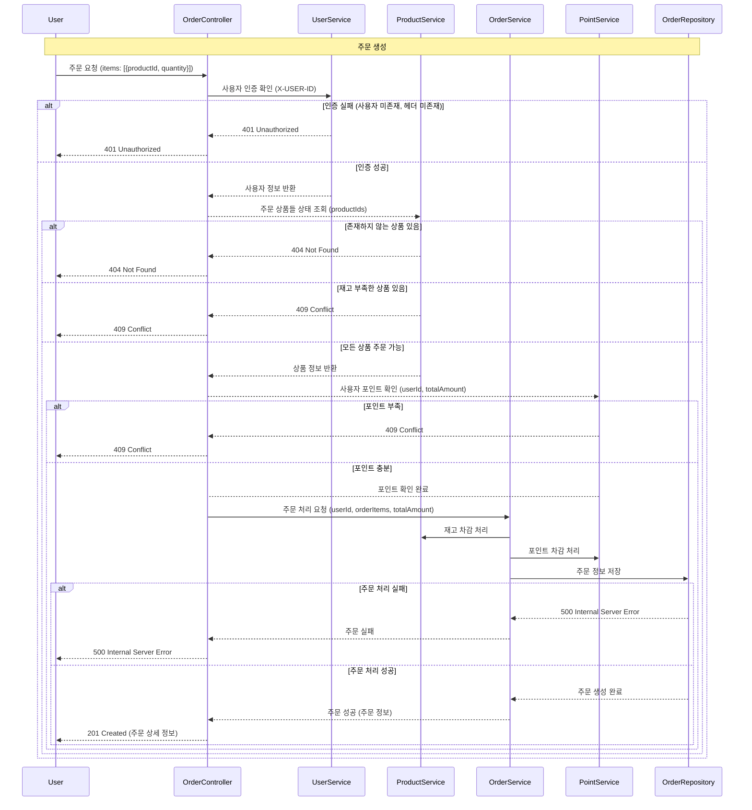
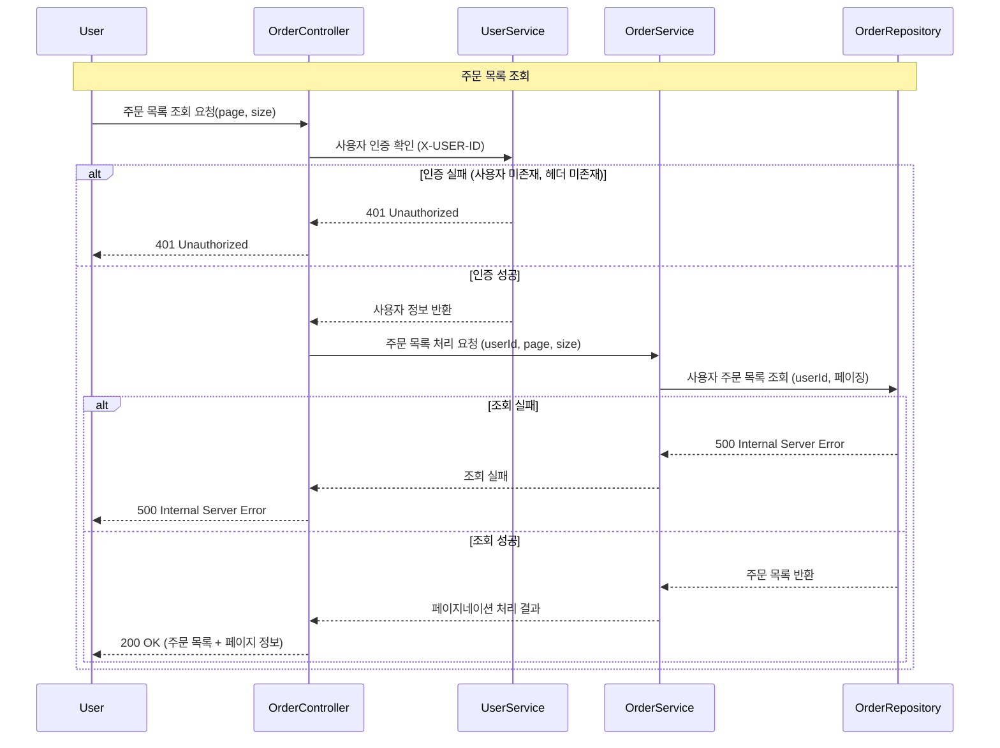
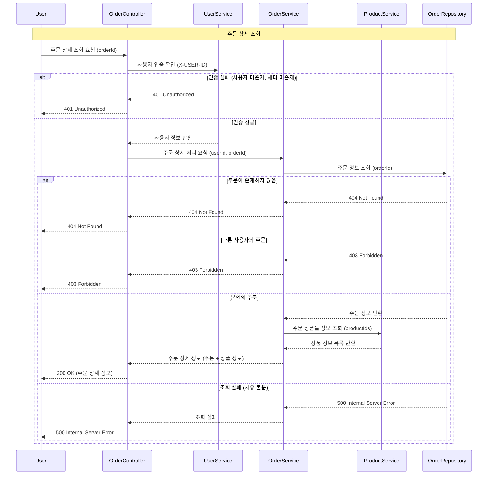

# 브랜드 & 상품

```mermaid
sequenceDiagram 
    participant U as User
    participant PC as ProductController
    participant PS as ProductService
    participant PR as ProDuctRepository
    
    Note over U, PR: 상품 목록 조회
        
    U ->> PC: 상품 목록 조회 요청 (page, size, sort, brandId)
    PC ->> PS: 상품 목록 처리 요청 (필터링 / 정렬 파라미터)
    PS ->> PR: 상품 데이터 조회 (조건별)
    
    alt 조회 성공
        PR -->> PS: 상품 목록 반환
        PS -->> PC: 페이지네이션 처리 결과
        PC -->> U: 200 OK (상품 목록 + 페이지 정보) 
    else 조회 실패
        PR -->> PS: 500 Internal Server Error
        PS -->> PC: 조회 실패
        PC -->> U: 500 Internal Server Error
    end

    Note over U, PR: 상품 상세 조회
    
    U ->> PC: 상품 상세 조회 요청 (productId)
    PC ->> PS: 상품 상세 처리 요청 (productId)
    PS ->> PR: 상품 데이터 조회 (조건별)

    alt 상품 존재
        PR -->> PS: 상품 상세 정보 반환
        PS -->> PC: 상품 데이터 처리
        PC -->> U: 200 OK (상품 상세 정보)
    else 상품 미존재
        PR -->> PS: 조회 결과 없음
        PS -->> PC: 404 Not Found
        PC -->> U: 404 Not Found 
    else 조회 실패
        PR -->> PS: 500 Internal Server Error
        PS -->> PC: 조회 실패
        PC -->> U: 500 internal Server Error
    end
        
```

```mermaid
sequenceDiagram
    participant U as User
    participant BC as BrandController
    participant BS as BrandService
    participant BR as BrandRepository
    
    Note over U, BR: 브랜드 정보 조회
    
    U ->> BC: 브랜드 정보 조회 요청 (brandId)
    BC ->> BS: 브랜드 정보 처리 요청 (brandId)
    BS ->> BR: 브랜드 데이터 조회 (brandId)
    
    alt 브랜드 존재
        BR -->> BS: 브랜드 정보 반환
        BS -->> BC: 브랜드 데이터 처리
        BC -->> U: 200 OK
    else 브랜드 미존재
        BR -->> BS: 조회 결과 없음
        BS -->> BC: 404 Not Found
        BC -->> U: 404 Not Found
    else 조회 실패
        BR -->> BS: 500 Internal Server Error
        BS -->> BC: 조회 실패 
        BC -->> U: 500 Internal Server Error
    end

```

---

# 좋아요

```mermaid
sequenceDiagram
    participant U as User
    participant LC as LikeController
    participant US as UserService
    participant PS as ProductService
    participant LS as LikeService
    participant LR as LikeRepository
    participant PR as ProductRepository

    Note over U, PR: 상품 좋아요 등록
    
    U ->> LC: 좋아요 등록 요청 (productId)
    LC ->> US: 사용자 인증 확인 (X-USER-ID)
    
    alt 인증 실패 (사용자 미존재, 헤더 미존재)
        US -->> LC: 401 Unauthorized
        LC -->> U: 401 Unauthorized
    else 인증 성공
        US -->> LC: 사용자 정보 반환
        LC ->> PS: 상품 존재 여부 확인 (productId)
        
        alt 상품 미존재
            PS -->> LC: 404 Not Found
            LC -->> U: 404 Not FOund
        else 상품 존재
            PS -->> LC: 상품 정보 반환
            LC -->> LS: 좋아요 처리 요청(userId, productId)
            LS -->> LR: 기존 좋아요 조회(userId, productId)
            
            alt 기존 좋아요 존재
                LR -->> LS: 기존 좋아요 반환
                LS -->> LC: 상태 변경 없음
                LC -->> U: 200 OK (현재 상태)
            else 기존 좋아요 미존재
                LS -->> LR: 좋아요 등록
                alt 등록 실패
                    LR -->> LS: 500 Internal Server Error
                    LS -->> LC: 등록 실패
                    LC -->> U: 500 Internal Server Error
                else 등록 성공
                    LR -->> LS: 좋아요 등록 완료
                    LS ->> PR: 상품 좋아요 수 증가
                    PR -->> LS: 좋아요 수 업데이트 완료
                    LS -->> LC: 좋아요 처리 완료
                    LC -->> U: 200 OK(좋아요 상태 + 총 좋아요 수)
                end
            end
        end
    end
```

```mermaid
sequenceDiagram
    participant U as User
    participant LC as LikeController
    participant US as UserService
    participant PS as ProductService
    participant LS as LikeService
    participant LR as LikeRepository
    participant PR as ProductRepository

    Note over U, PR: 상품 좋아요 취소

    U ->> LC: 좋아요 취소 요청 (productId)
    LC ->> US: 사용자 인증 확인 (X-USER-ID)
    
    alt 인증 실패 (사용자 미존재, 헤더 미존재)
        US -->> LC: 401 Unauthorized
        LC -->> U: 401 Unauthorized
    else 인증 성공
        US -->> LC: 사용자 정보 반환
        LC ->> PS: 상품 존재 여부 확인 (productId)
        
        alt 상품 미존재
            PS -->> LC: 404 Not Found
            LC -->> U: 404 Not Found
        else 상품 존재
            PS -->> LC: 상품 정보 반환
            LC ->> LS: 좋아요 취소 요청 (userId, productId)
            LS ->> LR: 기존 좋아요 조회 (userId, productId)
            
            alt 좋아요 미존재
                LR -->> LS: 조회 결과 없음
                LS -->> LC: 상태 변경 없음
                LC -->> U: 200 OK (현재 상태)
            else 좋아요 존재
                LS ->> LR: 좋아요 삭제
                alt 삭제 실패
                    LR -->> LS: 500 Internal Server Error
                    LS -->> LC: 삭제 살패
                    LS -->> U: 500 Internal Server Error
                else 삭제 성공
                    LR -->> LS: 좋아요 삭제 완료
                    LS ->> PR: 상품 좋아요 수 감소
                    PR -->> LS: 좋아요 수 업데이트 완료
                    LS -->> LC: 좋아요 처리 완료
                    LC -->> U: 200 OK (좋아요 상태 + 총 좋아요 수)
                end
            end
        end
    end
```

```mermaid
sequenceDiagram
    participant U as User
    participant LC as LikeController
    participant US as UserService
    participant PS as ProductService
    participant LS as LikeService
    participant LR as LikeRepository

    Note over U, LR: 내가 좋아요한 상품 목록 조회

    U ->> LC: 좋아요 목록 조회 요청 (page, size)
    LC ->> US: 사용자 인증 확인 (X-USER-ID)
    
    alt 인증 실패 (사용자 미존재, 헤더 미존재)
        US -->> LC: 401 Unauthorized
        LC -->> U: 401 Unauthorized
    else 인증 성공
        US -->> LC: 사용자 정보 반환
        LC ->> LS: 좋아요 목록 처리 요청 (userId, page, size)
        LS ->> LR: 사용자 좋아요 목록 조회 (userId, 페이징)
        
        alt 조회 성공
            LR -->> LS: 좋아요 목록 반환 (productIds)
            LS ->> PS: 상품 정보 일괄 조회 (productIds)
            PS -->> LS: 상품 정보 목록 반환
            LS -->> LC: 페이지네이션 처리 결과 (좋아요 + 상품 정보)
            LC -->> U: 200 OK (좋아요 목록 + 페이지 정보)
        else 조회 실패
            LR -->> LS: 500 Internal Server Error
            LS -->> LC: 조회 실패
            LC --> U: 500 Internal Server Error
        end
    end
```

# 주문 & 결제

```mermaid

sequenceDiagram
    participant U as User
    participant OC as OrderController
    participant US as UserService
    participant PS as ProductService
    participant OS as OrderService
    participant PointS as PointService
    participant OR as OrderRepository

    Note over U, OR: 주문 생성

    U ->> OC: 주문 요청 (items: [{productId, quantity}])
    OC ->> US: 사용자 인증 확인 (X-USER-ID)

    alt 인증 실패 (사용자 미존재, 헤더 미존재)
        US -->> OC: 401 Unauthorized
        OC -->> U: 401 Unauthorized 
    else 인증 성공
        US -->> OC: 사용자 정보 반환
        OC -->> PS: 주문 상품들 상태 조회 (productIds)
        
        alt 존재하지 않는 상품 있음
            PS -->> OC: 404 Not Found
            OC -->> U: 404 Not Found
        else 재고 부족한 상품 있음
            PS -->> OC: 409 Conflict
            OC -->> U: 409 Conflict
        else 모든 상품 주문 가능
            PS -->> OC: 상품 정보 반환
            OC -->> PointS: 사용자 포인트 확인 (userId, totalAmount)
        
            alt 포인트 부족
                PointS -->> OC: 409 Conflict
                OC -->> U: 409 Conflict
            else 포인트 충분
                PointS --> OC: 포인트 확인 완료
                OC ->> OS: 주문 처리 요청 (userId, orderItems, totalAmount)
                OS ->> PS: 재고 차감 처리
                OS ->> PointS: 포인트 차감 처리
                OS ->> OR: 주문 정보 저장
                
                alt 주문 처리 실패 
                    OR -->> OS: 500 Internal Server Error
                    OS -->> OC: 주문 실패
                    OC -->> U: 500 Internal Server Error
                else 주문 처리 성공
                    OR -->> OS: 주문 생성 완료 
                    OS -->> OC: 주문 성공 (주문 정보)
                    OC -->> U: 201 Created (주문 상세 정보)
                end
            end
        end
    end
```

```mermaid
sequenceDiagram
    participant U as User
    participant OC as OrderController
    participant US as UserService
    participant OS as OrderService
    participant OR as OrderRepository

    Note over U, OR: 주문 목록 조회

    U ->> OC: 주문 목록 조회 요청(page, size)
    OC ->> US: 사용자 인증 확인 (X-USER-ID)
    
    alt 인증 실패 (사용자 미존재, 헤더 미존재)
        US -->> OC: 401 Unauthorized
        OC -->> U: 401 Unauthorized
    else 인증 성공
        US -->> OC: 사용자 정보 반환
        OC ->> OS: 주문 목록 처리 요청 (userId, page, size)
        OS ->> OR: 사용자 주문 목록 조회 (userId, 페이징)
    
        alt 조회 실패
            OR -->> OS: 500 Internal Server Error
            OS -->> OC: 조회 실패
            OC -->> U: 500 Internal Server Error
        else 조회 성공
            OR -->> OS: 주문 목록 반환 
            OS -->> OC: 페이지네이션 처리 결과
            OC -->> U: 200 OK (주문 목록 + 페이지 정보)
        end
    end
```

```mermaid
sequenceDiagram
    participant U as User
    participant OC as OrderController
    participant US as UserService
    participant OS as OrderService
    participant PS as ProductService
    participant OR as OrderRepository

    Note over U, OR: 주문 상세 조회
    
    U ->> OC: 주문 상세 조회 요청 (orderId)
    OC ->> US: 사용자 인증 확인 (X-USER-ID)

    alt 인증 실패 (사용자 미존재, 헤더 미존재)
        US -->> OC: 401 Unauthorized
        OC -->> U: 401 Unauthorized
    else 인증 성공
        US -->> OC: 사용자 정보 반환
        OC ->> OS: 주문 상세 처리 요청 (userId, orderId)
        OS ->> OR: 주문 정보 조회 (orderId)

        alt 주문이 존재하지 않음
            OR -->> OS: 404 Not Found
            OS -->> OC: 404 Not Found
            OC -->> U: 404 Not Found
        else 다른 사용자의 주문
            OR -->> OS: 403 Forbidden
            OS -->> OC: 403 Forbidden
            OC -->> U: 403 Forbidden
        else 본인의 주문
            OR -->> OS: 주문 정보 반환
            OS ->> PS: 주문 상품들 정보 조회 (productIds)
            PS -->> OS: 상품 정보 목록 반환
            OS -->> OC: 주문 상세 정보 (주문 + 상품 정보)
            OC -->> U: 200 OK (주문 상세 정보)
        else 조회 실패 (사유 불문)
            OR -->> OS: 500 Internal Server Error
            OS -->> OC: 조회 실패
            OC -->> U: 500 Internal Server Error
        end
    end
```
