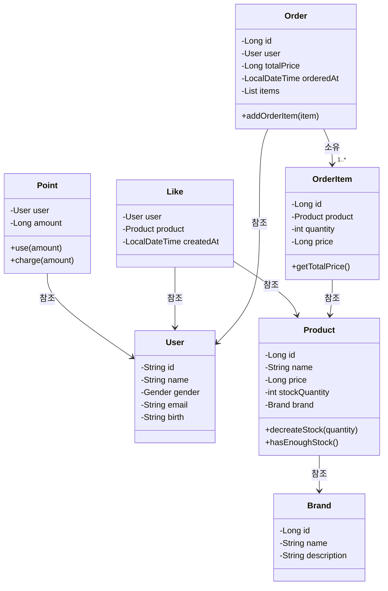

```mermaid
classDiagram
    class User {
        -String id
        -String name
        -Gender gender
        -String email
        -String birth
    }
    
    class Point {
        -User user
        -Long amount
        +use(amount)
        +charge(amount)
    }

    class Product {
        -Long id
        -String name
        -Long price
        -int stockQuantity
        -Brand brand
        +decreateStock(quantity)
        +hasEnoughStock()
    }

    class Brand {
        -Long id
        -String name
        -String description
    }
    
    class Like {
        -User user
        -Product product
        -LocalDateTime createdAt
    }
    
    class Order {
        -Long id
        -User user
        -Long totalPrice
        -LocalDateTime orderedAt
        -List<OrderItem> items
        +addOrderItem(item)
    }
    
    class OrderItem {
        -Long id
        -Product product
        -int quantity
        -Long price
        +getTotalPrice()
    }
    
    %% 연관 관계
    Point --> User: 참조
    Product --> Brand: 참조
    Like --> User: 참조
    Like --> Product: 참조
    Order --> User: 참조
    Order --> "1..*" OrderItem: 소유
    OrderItem --> Product: 참조
    
```
