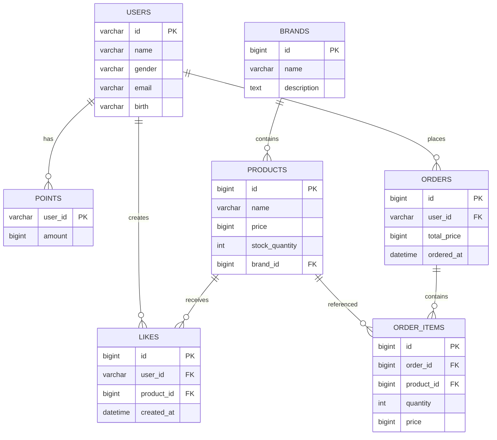

```mermaid
erDiagram
    USERS {
        varchar id PK
        varchar name
        varchar gender
        varchar email
        varchar birth
    }
    
    POINTS {
        varchar user_id PK
        bigint amount
    }
    
    BRANDS {
        bigint id PK
        varchar name
        text description
    }
    
    PRODUCTS {
        bigint id PK
        varchar name
        bigint price
        int stock_quantity
        bigint brand_id FK
    }
    
    LIKES {
        bigint id PK
        varchar user_id FK
        bigint product_id FK
        datetime created_at
    }
    
    ORDERS {
        bigint id PK
        varchar user_id FK
        bigint total_price
        datetime ordered_at
    }
    
    ORDER_ITEMS {
        bigint id PK
        bigint order_id FK
        bigint product_id FK
        int quantity
        bigint price
    }
    
    %% 연관 관계
    USERS ||--o{ POINTS : has
    USERS ||--o{ LIKES : creates
    USERS ||--o{ ORDERS : places
    
    BRANDS ||--o{ PRODUCTS : contains
    
    PRODUCTS ||--o{ LIKES : receives
    PRODUCTS ||--o{ ORDER_ITEMS : referenced
    
    ORDERS ||--o{ ORDER_ITEMS : contains
```
